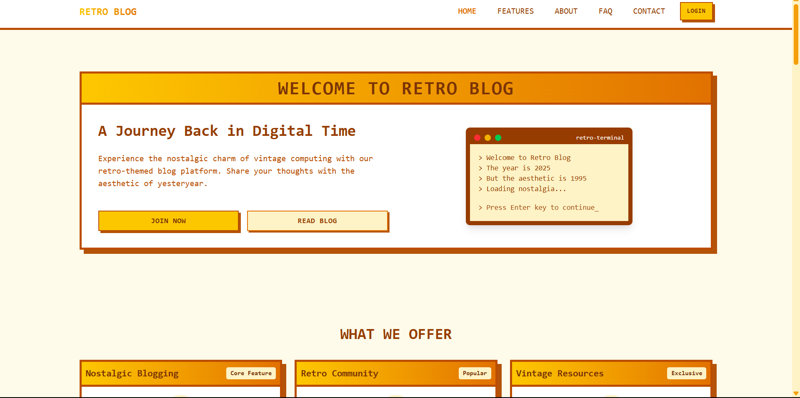

# 🕹️ Retro Blog - A Nostalgic Take on Modern Stories

<div align="center">
  
  
  [](https://3bdulrahmn69-retro-blog.netlify.app/)
  [](https://github.com/3bdulrahmn69/retro-blog)
  [](https://3bdulrahmn.vercel.app/)
</div>

## 📖 About

Retro Blog brings you back to the golden days of the internet! This nostalgic web application combines vintage aesthetics with modern web technologies to deliver stories about technology, gaming, and digital culture. Experience the charm of retro design while enjoying the performance of cutting-edge development practices.

### ✨ Features

- 🎮 **Retro Gaming Aesthetic** - Pixel-perfect design inspired by classic arcade games
- 📱 **Fully Responsive** - Seamless experience across all devices
- 🔐 **Authentication System** - Secure user login and registration
- ✍️ **Blog Management** - Create, read, update, and delete blog posts
- 🗂️ **Category Management** - Organize posts into categories
- 🖼️ **Image Uploads** - Upload and manage images for blog posts
- 🔍 **Search Functionality** - Find posts easily with search
- 🎨 **Custom UI Components** - Hand-crafted retro-styled components
- 🌟 **Interactive Animations** - Smooth transitions and engaging effects
- 📊 **JSON Server Backend** - Mock API for development and testing
- 🎯 **TypeScript Support** - Type-safe development experience

## 🛠️ Tech Stack

### Frontend

- **React 18** - Modern React with hooks and concurrent features
- **TypeScript** - Type-safe JavaScript development
- **Tailwind CSS** - Utility-first CSS framework for styling
- **React Router** - Client-side routing for single-page application
- **Vite** - Lightning-fast build tool and development server

### Development Tools

- **ESLint** - Code linting and quality assurance
- **Modern ES6+** - Latest JavaScript features
- **JSON Server** - Mock REST API for development

## 🚀 Quick Start

### Prerequisites

- Node.js (v16 or higher)
- npm or yarn package manager

### Installation

1. **Clone the repository**

   ```bash
   git clone https://github.com/3bdulrahmn69/retro-blog.git
   cd retro-blog
   ```

2. **Install dependencies**

   ```bash
   npm install
   ```

3. **Start the JSON server (for mock API)**

   ```bash
   npm run server
   ```

4. **Start the development server**

   ```bash
   npm run dev
   ```

5. **Open your browser**
   Navigate to `http://localhost:5173` to see the application

### Available Scripts

```bash
# Development
npm run dev          # Start development server
npm run server       # Start JSON server for mock API

# Building
npm run build        # Build for production
npm run preview      # Preview production build

# Code Quality
npm run lint         # Run ESLint
npm run lint:fix     # Fix ESLint issues automatically
```

## 📁 Project Structure

```
retro-blog/
├── public/                 # Static assets
│   ├── logo.jpg           # Application logo
│   └── retro-blog.png     # Social media preview image
├── src/
│   ├── components/        # Reusable UI components
│   │   ├── auth/         # Authentication components
│   │   ├── sections/     # Page sections
│   │   └── ui/           # Generic UI components
│   ├── context/          # React context providers
│   ├── lib/              # Utility libraries
│   ├── pages/            # Application pages
│   ├── types/            # TypeScript type definitions
│   └── utils/            # Utility functions
├── data/
│   └── db.json           # Mock database for JSON server
└── ...config files
```

## 🎨 Design Philosophy

This project embraces the nostalgic charm of retro computing and gaming:

- **Color Palette**: Warm amber tones reminiscent of classic CRT monitors
- **Typography**: Monospace fonts for that authentic terminal feel
- **Animations**: Subtle retro-inspired transitions and effects
- **UI Elements**: Pixel-perfect buttons and controls with vintage styling

## 🔧 Configuration

### ESLint Configuration

The project uses a modern ESLint setup with TypeScript support. The configuration is in [`eslint.config.js`](eslint.config.js).

### Vite Configuration

Build tool configuration is managed in [`vite.config.ts`](vite.config.ts) with optimized settings for React development.

### TypeScript Configuration

- [`tsconfig.json`](tsconfig.json) - Main TypeScript configuration
- [`tsconfig.app.json`](tsconfig.app.json) - Application-specific settings
- [`tsconfig.node.json`](tsconfig.node.json) - Node.js environment settings

## 🌐 Deployment

The application is deployed on Netlify and can be accessed at:
**[https://3bdulrahmn69-retro-blog.netlify.app/](https://3bdulrahmn69-retro-blog.netlify.app/)**

### Deploy Your Own

1. Fork this repository
2. Connect your Netlify account to your GitHub
3. Deploy with build command: `npm run build`
4. Set publish directory to: `dist`

## 🤝 Contributing

Contributions are welcome! Here's how you can help:

1. Fork the repository
2. Create a feature branch (`git checkout -b feature/amazing-feature`)
3. Commit your changes (`git commit -m 'Add amazing feature'`)
4. Push to the branch (`git push origin feature/amazing-feature`)
5. Open a Pull Request

### Code Style

- Follow the existing ESLint configuration
- Use TypeScript for type safety
- Write descriptive commit messages
- Test your changes thoroughly

## 📄 License

This project is open source and available under the [MIT License](LICENSE).

## 👨‍💻 Developer

**Abdulrahman Moussa**

- 🌐 Portfolio: [3bdulrahmn.vercel.app](https://3bdulrahmn.vercel.app/)
- 💼 LinkedIn: [linkedin.com/in/3bdulrahmn69](https://linkedin.com/in/3bdulrahmn69)
- 🐙 GitHub: [github.com/3bdulrahmn69](https://github.com/3bdulrahmn69)
- 📧 Email: abdulrahmanmoussa69@gmail.com

## 🙏 Acknowledgments

- Inspired by the golden age of computing and retro gaming
- Built with modern web technologies and best practices
- Special thanks to the open-source community

---

<div align="center">
  <p>Made with 64KB of RAM and plenty of nostalgia 🕹️</p>
  <p>© 2024 Abdulrahman Moussa. All rights reserved.</p>
</div>
